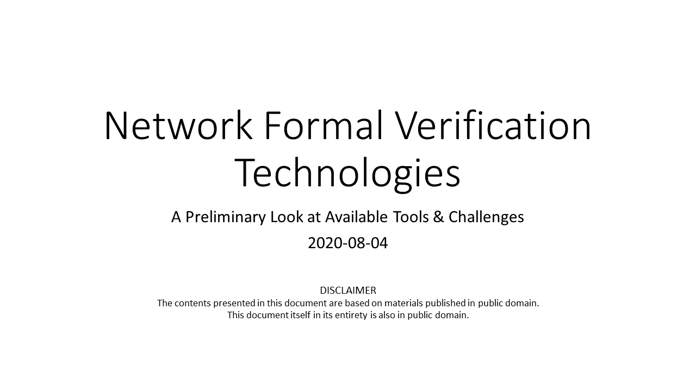
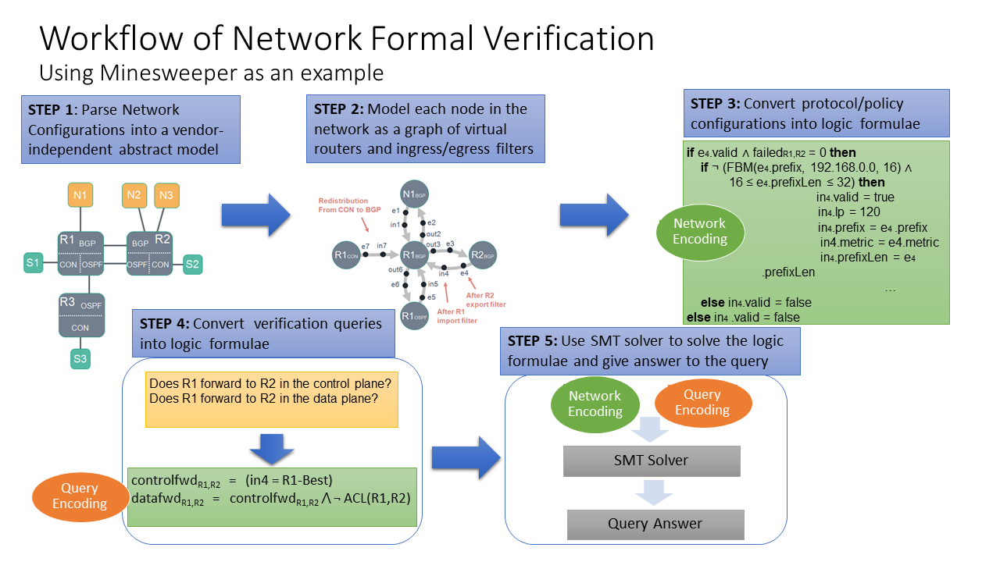
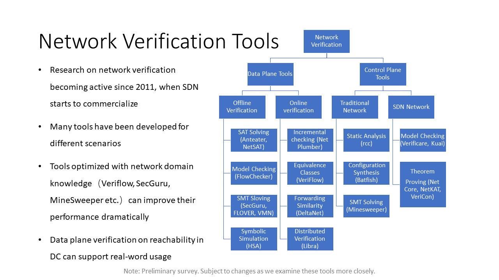
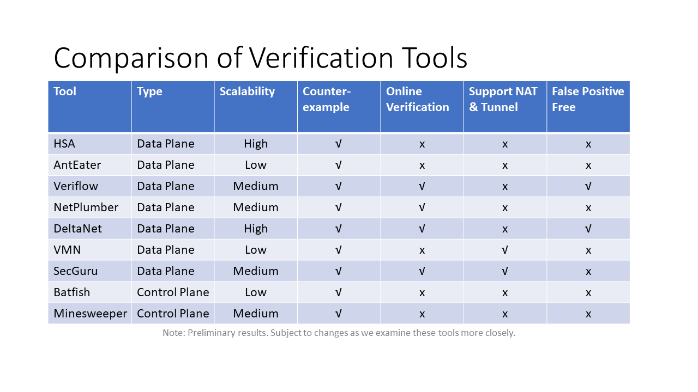
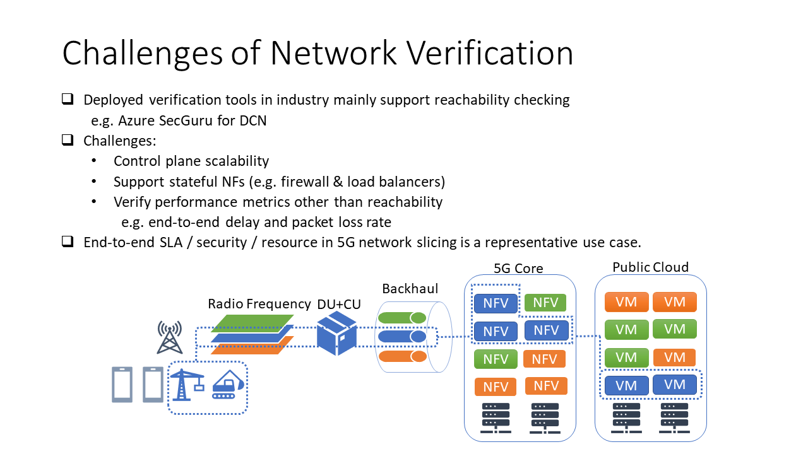

# Network Formal Verification - 2020-08-04

# Feedback

Please note this is a very preliminary look at the recent formal verification technologies for networks. We are looking into some of the  tools more closely.

If you have suggestions to improve the slides, please use [Issues](https://github.com/beikacao/blog/issues). Thank you!

# License

See [LICENSE](../LICENSE).
