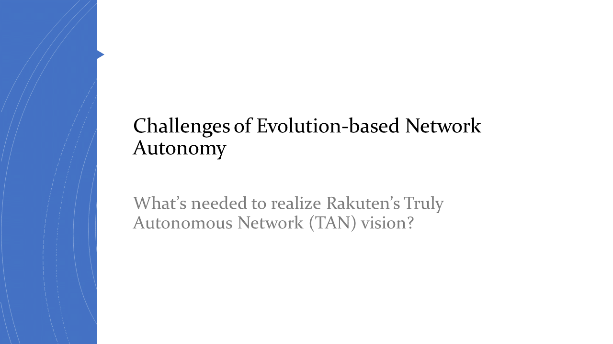
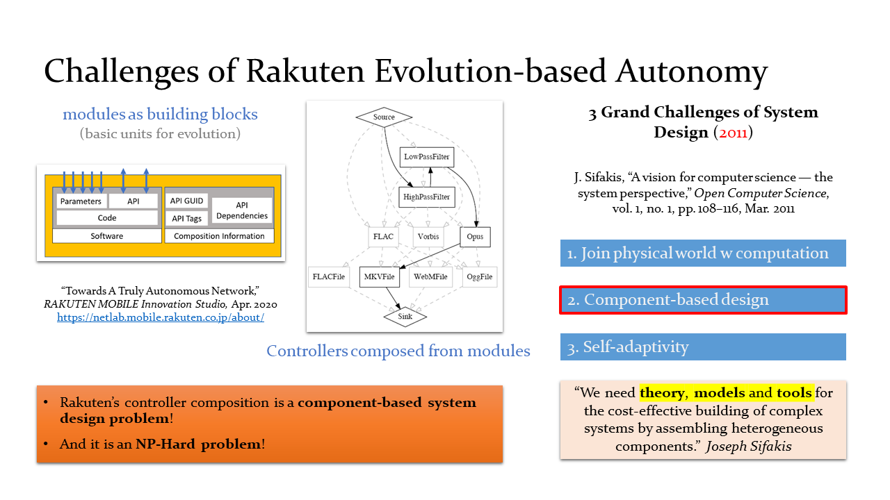
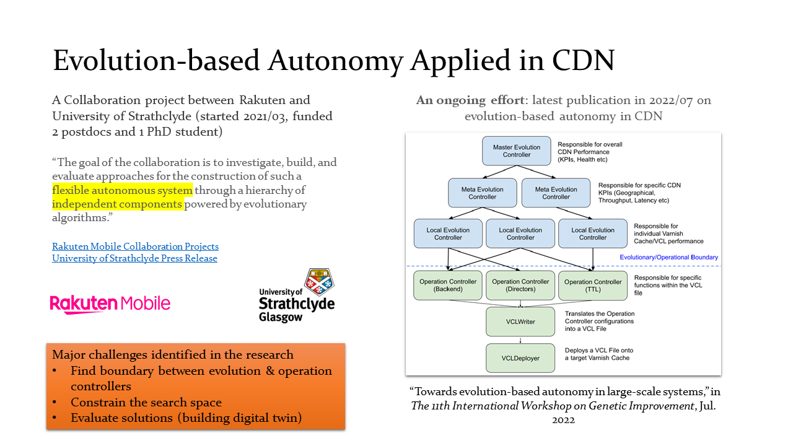
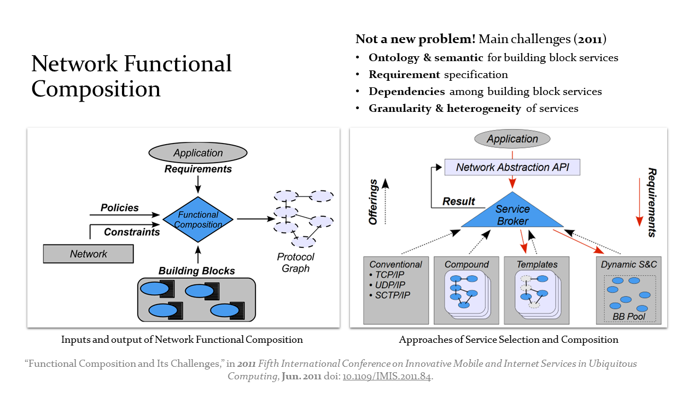
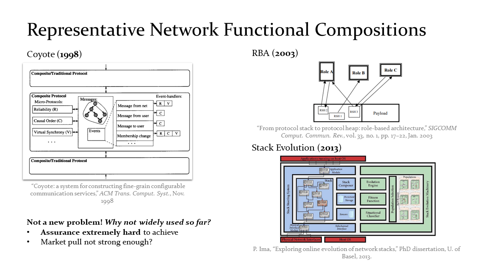
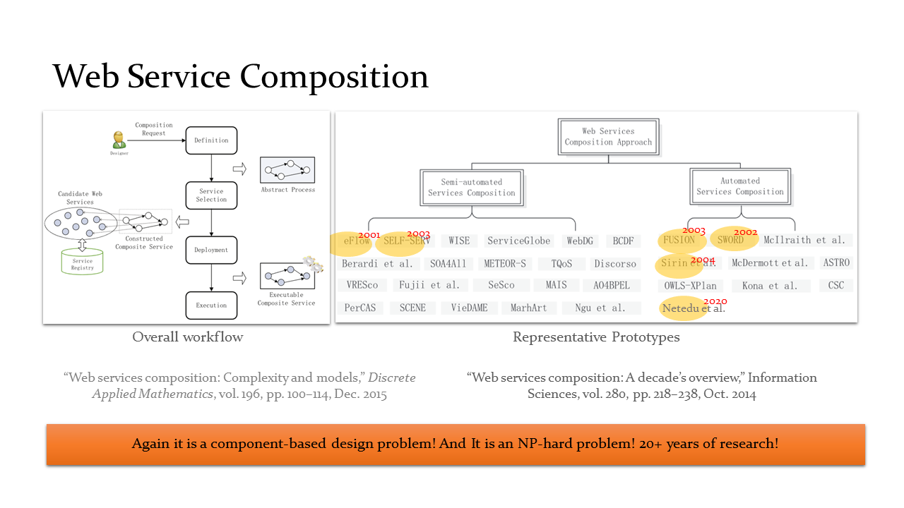
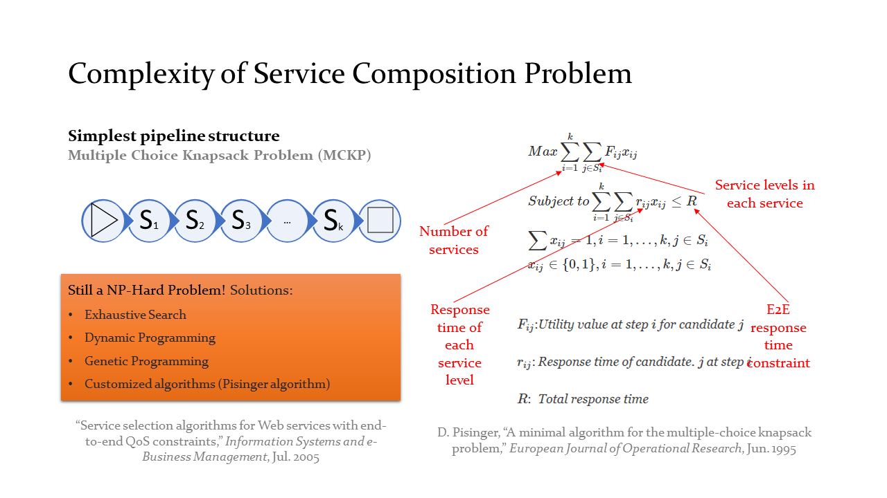
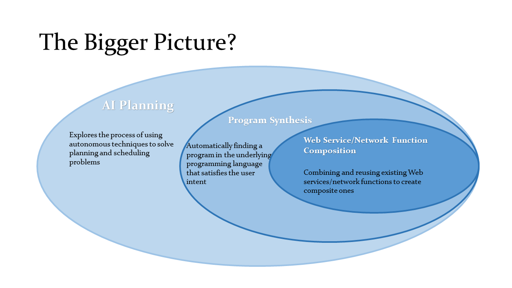

# Challenges of Evolution-based Network Autonomy (Service Composition & Complexity) - 2022-06-09

# Feedback

If you have suggestions to improve the slides, please use [Issues](https://github.com/beikacao/blog/issues). Thank you!

# License

See [LICENSE](../LICENSE).
