# Neuro-symbolic AI (A Preliminary Survey) - 2022-08-04

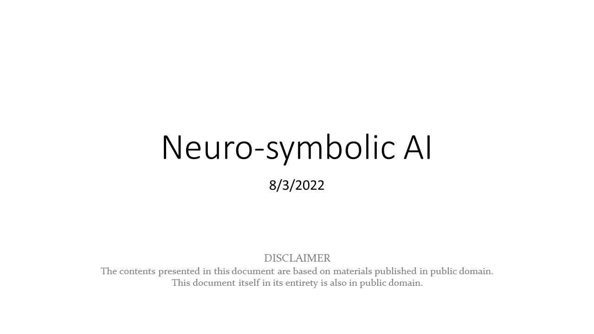

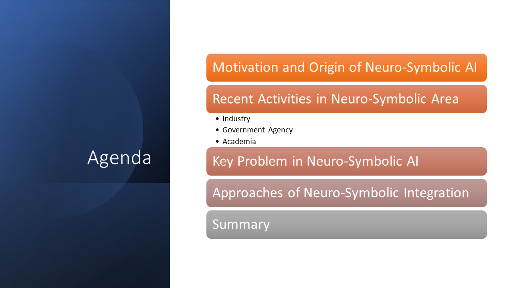

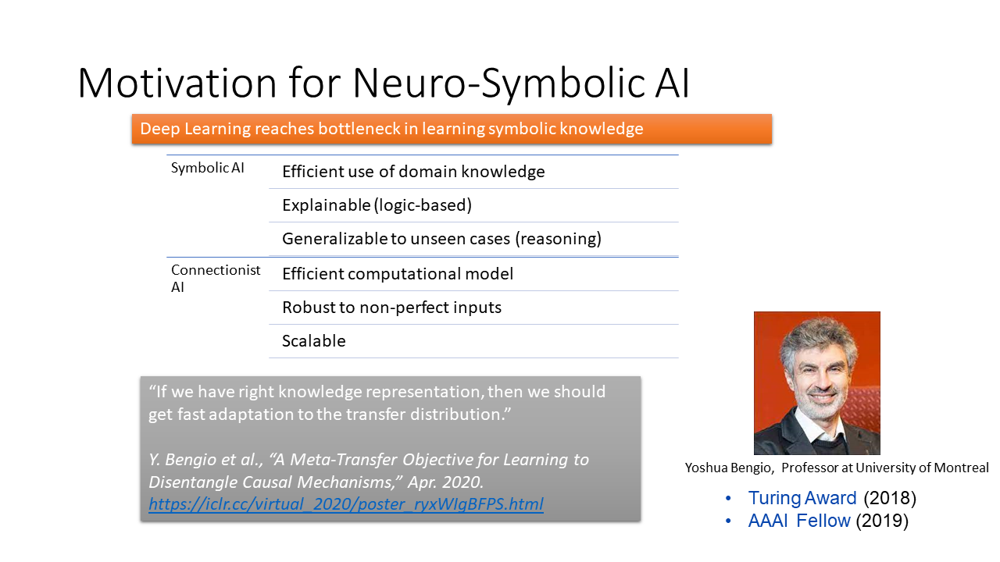

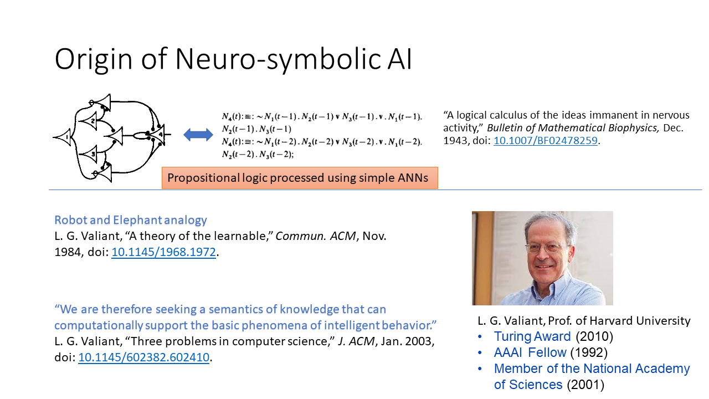

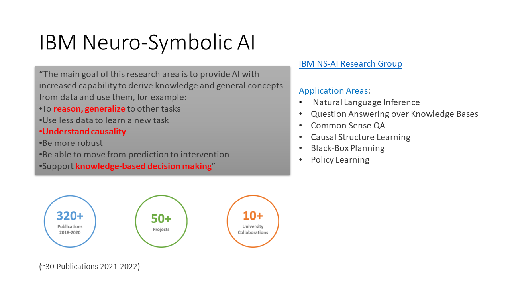

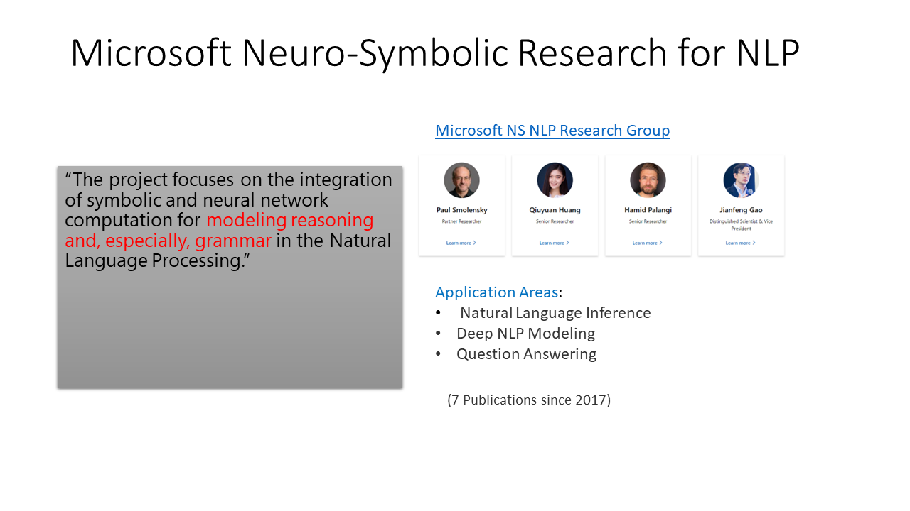

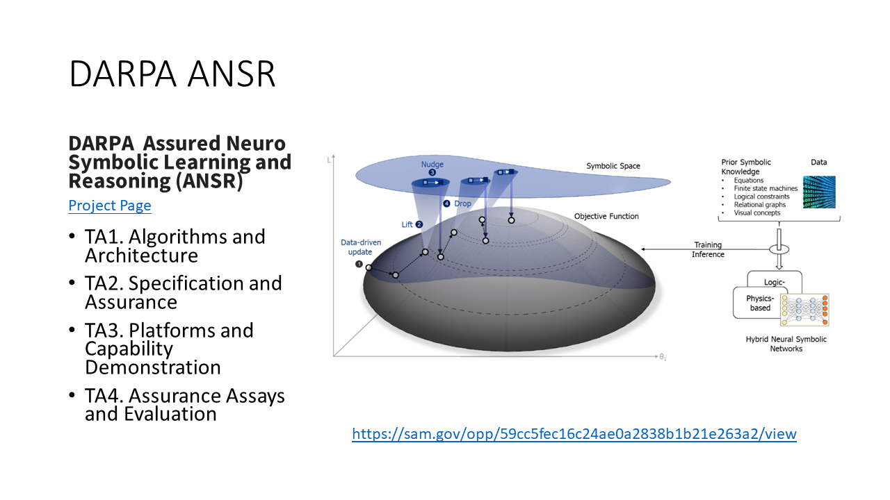

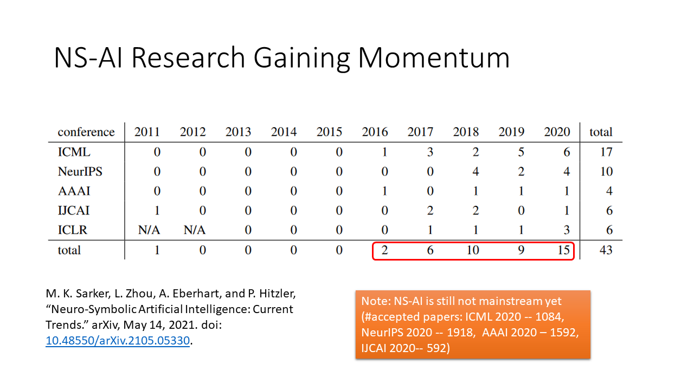

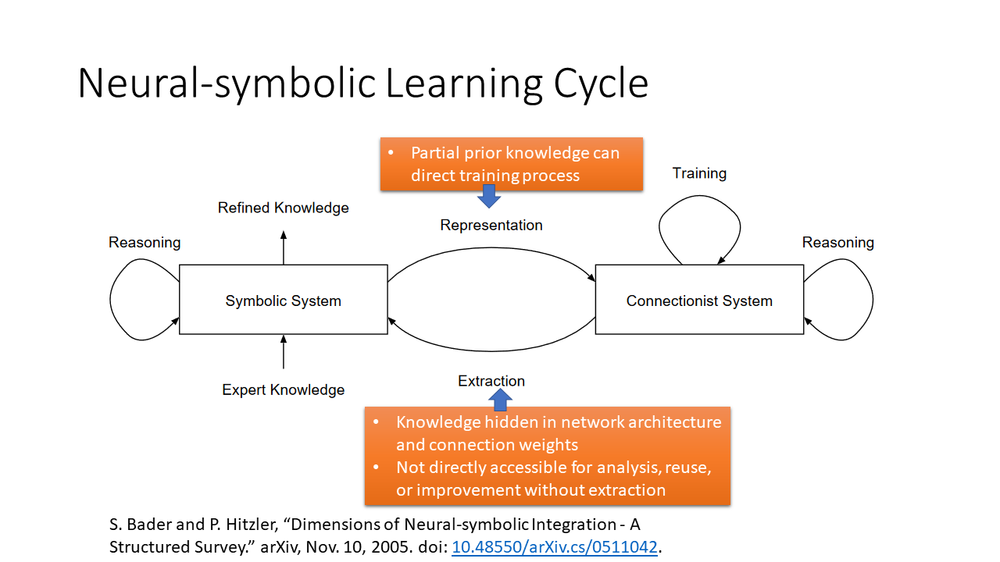

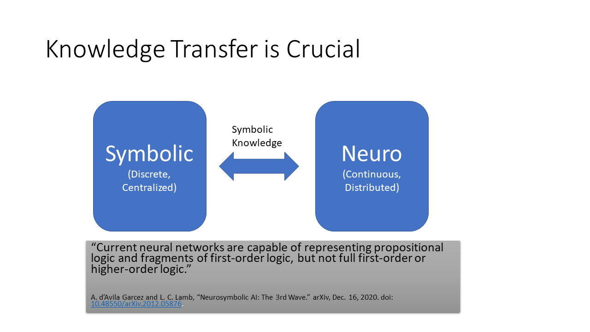

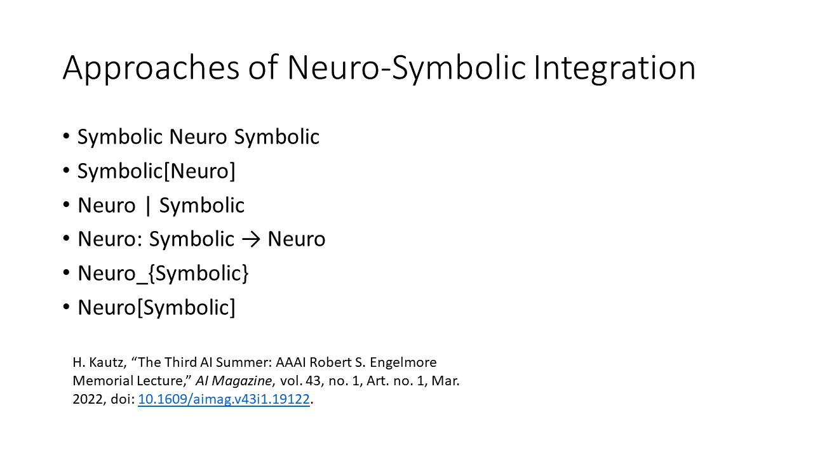

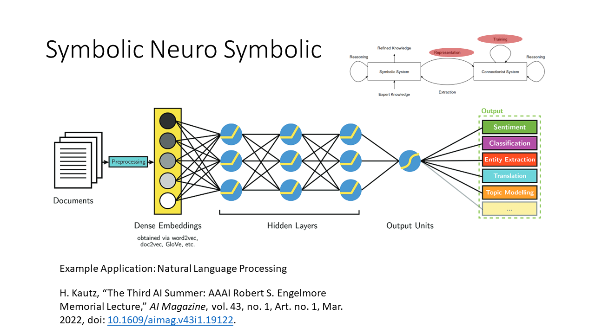

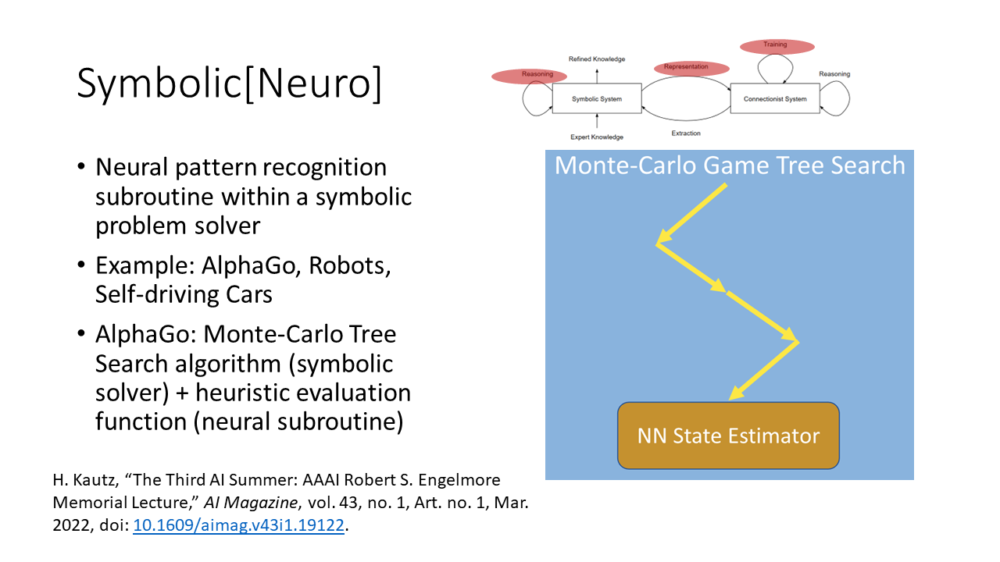

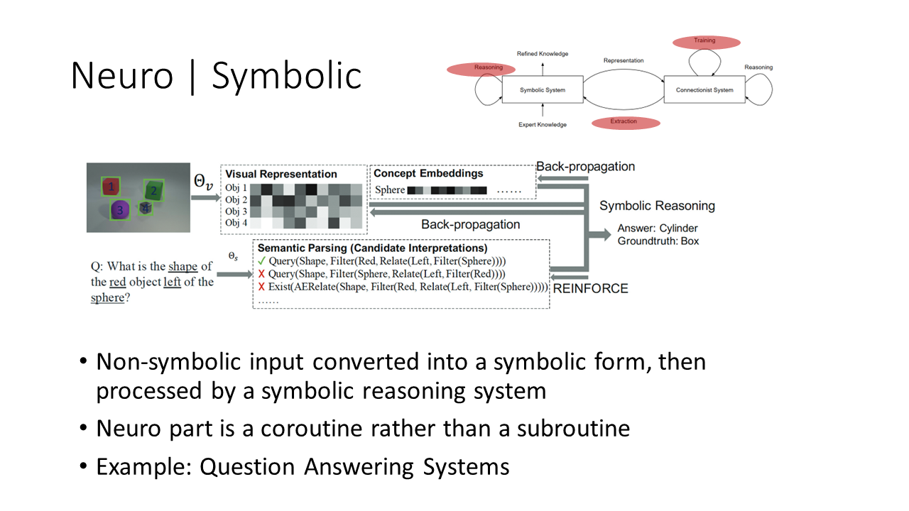

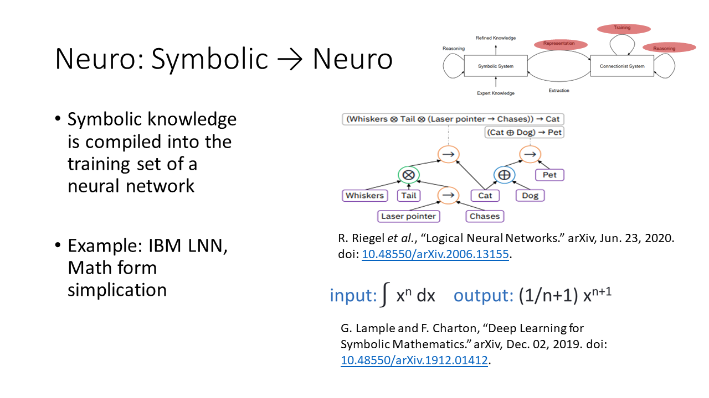

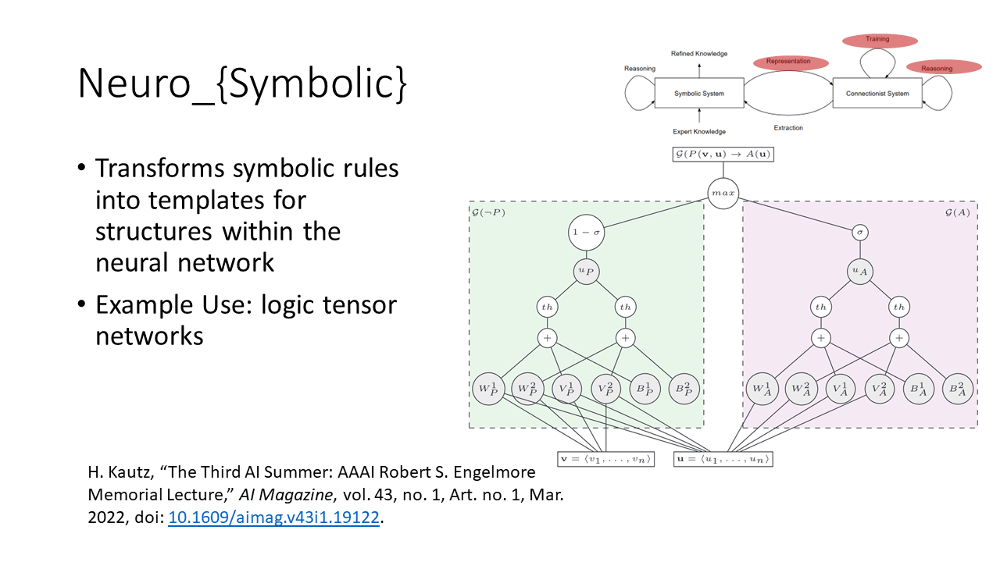

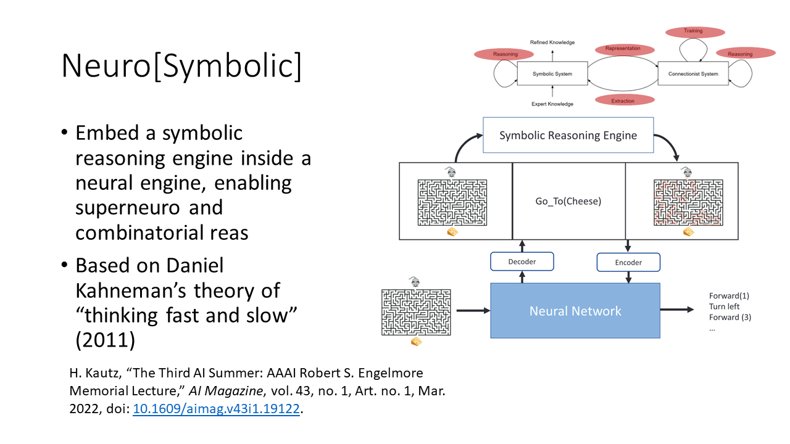

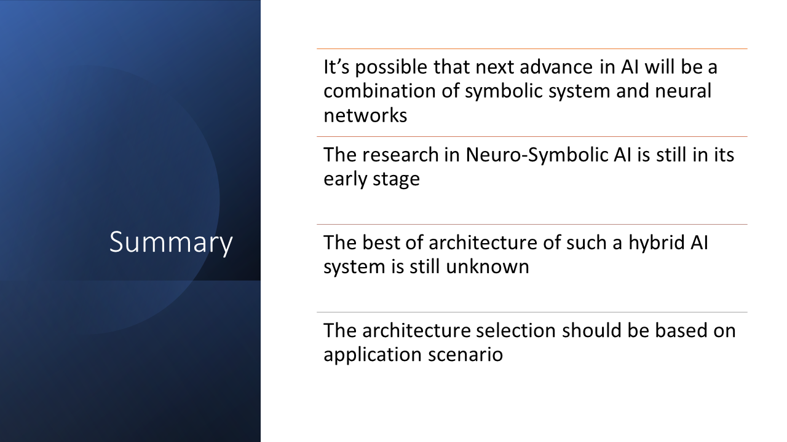

# Feedback

If you have suggestions to improve the slides, please use [Issues](https://github.com/beikacao/blog/issues). Thank you!

# License

See [LICENSE](../LICENSE).
